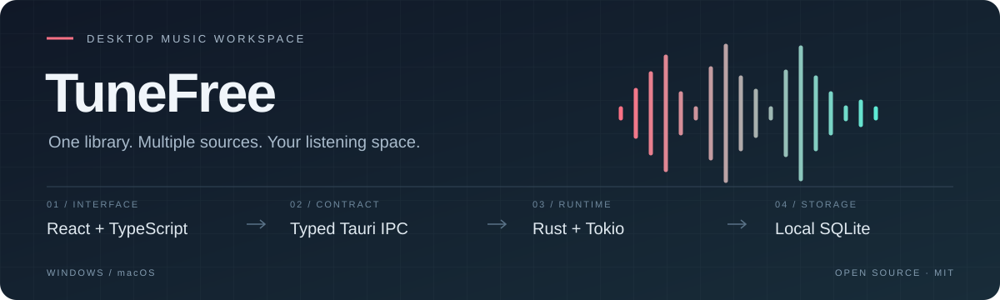
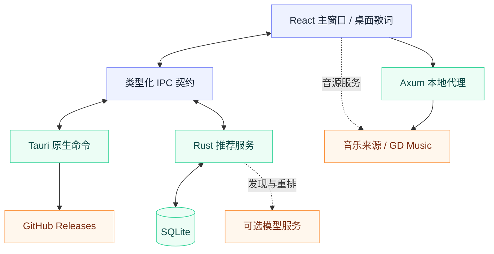

<div align="center">


# TuneFree Desktop

聚合音乐来源，连接本地曲库、桌面歌词与智能发现。

[](https://github.com/alanbulan/TuneFree/releases/latest)
[](https://github.com/alanbulan/TuneFree/actions/workflows/ci.yml)
[](https://github.com/alanbulan/TuneFree/actions/workflows/release.yml)
[](./LICENSE)
[](https://linux.do/)

[下载安装](./INSTALL_GUIDE.md) · [技术架构](#技术架构) · [工程质量](#工程质量) · [社区与认可](#社区与认可) · [发布流程](./RELEASE.md)



</div>

TuneFree Desktop 是 TuneFree 的 Tauri v2 桌面客户端，主开发分支为 `tauri`。界面由 React 与 TypeScript 构建，Rust 承担原生能力、音乐解析、本地代理和推荐数据管理；应用复用系统 WebView。

## 下载安装

| 平台 | 安装资产 | 说明 |
| --- | --- | --- |
| Windows x64 | `TuneFree_{version}_x64-setup.exe` | NSIS 安装向导 |
| macOS 11+ · Apple Silicon / Intel | `TuneFree_{version}_universal.dmg` | 同一通用安装包覆盖两种架构 |

从 [GitHub Releases](https://github.com/alanbulan/TuneFree/releases/latest) 下载。`.sig`、`.app.tar.gz` 和 `latest.json` 用于自动更新，普通安装只需下载对应安装包。

Mac 包采用 ad-hoc 本地签名，尚未进行 Apple Developer ID 签名与公证，首次打开方式见[安装说明](./INSTALL_GUIDE.md)。Windows 与 Mac 均支持保存自定义 AI 模型 API Key；本地推荐与外部 Embeat 链路的能力边界见下文。Linux 暂无官方安装包。

## 桌面体验

| 音乐工作空间 | 桌面集成 | 智能发现 |
| --- | --- | --- |
| 多来源搜索、播放队列与收藏 | 独立透明桌面歌词、逐字高亮 | 基于曲库与播放反馈的本地推荐 |
| 歌单导入、下载与离线曲库 | 歌词锁定、置顶、位置与尺寸记忆 | 可选的 OpenAI 兼容模型发现与重排 |
| 全屏播放器与主题设置 | 托盘控制、签名自动更新 | Embeat 自然语言语境搜歌 |

**Bloub 音乐伙伴**复用上游 TypeScript 动画核心，通过项目维护的 React 适配层随播放与推荐状态变化。来源和许可见 [vendor/bloub](./vendor/bloub/README.md)。

## 技术栈


| 层级 | 技术 | 职责与实现入口 |
| --- | --- | --- |
| 界面与交互 | React 19、TypeScript 7、Framer Motion | 主窗口、功能页面、播放器与动画；[src/desktop](./src/desktop) |
| 播放与服务编排 | TypeScript、浏览器音频能力 | 播放状态、音源服务、解析与歌词；[src/core](./src/core) |
| 原生契约 | Tauri v2、类型化 IPC | 命令、事件、错误码的统一入口；[src/core/ipc](./src/core/ipc) |
| 桌面宿主 | Rust、Tauri 插件 | 窗口、下载、托盘、系统命令和更新；[src-tauri/src/app](./src-tauri/src/app) |
| 本地网络 | Axum、Tokio、Reqwest | 回环 HTTP 服务、播放解析与代理；[server.rs](./src-tauri/src/server.rs)、[api](./src-tauri/src/api) |
| 推荐与存储 | SQLite、rusqlite、OpenAI 兼容协议 | 曲库、事件、反馈、候选召回与模型编排；[recommendation](./src-tauri/src/recommendation) |
| 构建与验证 | Vite、Vitest、Oxlint、Cargo、GitHub Actions | 前端打包、契约检查、测试、原生构建和发布 |

精确版本以 [package-lock.json](./package-lock.json)、[Cargo.lock](./src-tauri/Cargo.lock) 和 [rust-toolchain.toml](./rust-toolchain.toml) 为准。应用关于页在构建时读取这些文件，避免手工维护版本信息。

## 技术架构



### 三条关键链路

| 链路 | 数据经过哪里 | 约束 |
| --- | --- | --- |
| 搜索 → 播放 | 关键词 → 音源搜索 → 曲目身份 → 播放解析 → 播放器 | 聚合搜索默认合并网易云、QQ、酷我；JOOX 需主动开启 |
| 个性化推荐 | 曲库与行为 → SQLite → 召回与排序 → 可选模型发现 / 重排 → 反馈回写 | 数据和任务状态由 Rust 本地服务管理，云端能力需用户配置 |
| Embeat 语境搜歌 | 自然语言 → Embeat 服务；失败时按现有 Pollinations 链路生成候选并检索真实曲目 | 与本地推荐独立；模型临时 ID 不作为可播放结果 |

### 工程边界

- **IPC 单一入口**：前端通过 `src/core/ipc` 调用 Tauri。CI 对 TypeScript 命令表与 Rust 注册表做双向比对，阻止契约漂移。
- **本地服务按启动隔离**：仅绑定 `127.0.0.1` 随机端口，每次启动生成访问令牌；前端通过 `get_local_server_info` 获取连接信息。受保护路由检查令牌，代理受来源与主机规则约束。
- **运行时地址不持久化**：前端不硬编码端口，也不保存已解析的本地服务 URL，避免下次启动使用失效地址。
- **持久化与凭据分离**：推荐数据进入 SQLite，Windows 模型密钥使用凭据管理器，macOS 使用系统钥匙串；两端共享保存、读取、删除与迁移逻辑，密钥不通过配置视图回传。
- **更新先验签**：Tauri updater 验证更新签名后安装；发布流程核对各平台资产与清单，再公开新版本。

<details>
<summary><strong>源码导航</strong></summary>

```text
app/                         桌面歌词页面、组件和样式
desktop-lyric/               桌面歌词独立 HTML 入口
src/core/                    播放器、状态、音源服务、解析与通用工具
src/core/ipc/                Tauri 命令、事件、错误码与类型契约
src/desktop/                 主窗口、功能页面与桌面交互
src-tauri/src/app/           原生命令、窗口、下载与更新编排
src-tauri/src/api/           音源解析与代理边界
src-tauri/src/recommendation 本地推荐、模型编排与 SQLite 持久化
vendor/bloub/                上游动画核心、版本来源与许可证
scripts/                     架构、IPC、发布和运行验收脚本
.github/workflows/           共享质量门禁与跨平台发布
```

</details>

## 开发与验证

环境：Node.js 24.15+、npm 12.0.2、Rust 1.98.1。Windows 需要 Visual Studio C++ Build Tools 与 WebView2；macOS 需要 Xcode Command Line Tools。

```sh
npm ci
npm run tauri dev
```

Vite 开发服务监听 `127.0.0.1:3101`。单独运行 `npm run dev` 只启动前端资源服务，原生窗口、完整数据和推荐能力需要 Tauri 后端。

<details>
<summary><strong>与 CI 对齐的验证命令</strong></summary>

```sh
npm run version:check
npm run lint
npm run typecheck
npm run architecture:check
npm run test:coverage
npm run audit
cargo fmt --manifest-path src-tauri/Cargo.toml --all -- --check
cargo clippy --manifest-path src-tauri/Cargo.toml --locked --all-targets --all-features -- -D warnings
cargo test --manifest-path src-tauri/Cargo.toml --locked --test app_tests -- --include-ignored
npx tauri build --no-bundle
npm run smoke
```

上述顺序对应共享 Windows 门禁。macOS 先通过 Tauri CLI 构建，以同步平台配置所需的透明窗口 feature，再执行 Cargo 检查；完整顺序见 [release.yml](./.github/workflows/release.yml)。

Clippy 的严格规则固化在 `Cargo.toml`。Tauri 的 `beforeBuildCommand` 已包含前端构建，不必额外重复 `npm run build`。真实音源核验：

```sh
npm run api:verify:gd
npm run api:verify:gd -- --source joox --details
```

</details>

## 工程质量

质量指标以仓库配置和可追溯的 Actions 运行记录为依据。

| 指标 | 当前门禁 | 证据 |
| --- | --- | --- |
| 前端行覆盖率 | **100% 阈值**，按配置纳入业务源码 | [Vitest 配置](./vitest.config.ts)；CI 上传 `coverage-lcov` |
| 静态检查 | Oxlint 零告警、TypeScript 类型检查、Rust fmt / Clippy | [共享 Validate 工作流](./.github/workflows/validate.yml) |
| 架构一致性 | 分层导入、文件规模、样式预算、IPC 双向契约检查 | [架构守卫](./scripts/check-architecture.mjs)、[IPC 守卫](./scripts/check-ipc-contract.mjs) |
| 依赖审计 | npm 高危及以上漏洞阻断流水线 | [package.json](./package.json) 中的 `audit` |
| 启动验收 | 真正运行程序，等待界面挂载并请求本地健康检查 | [smoke-test.mjs](./scripts/smoke-test.mjs) |
| 发布完整性 | Windows / macOS 安装与更新资产、签名、版本和平台 URL 检查 | [publish-release.mjs](./scripts/publish-release.mjs) |

覆盖率阈值不代表外部音乐源、付费模型或所有平台功能均已验收。启动测试使用隔离目录，并禁用云端模型与自动更新；真实 GD Music 接口通过 `npm run api:verify:gd` 单独验证。

## 构建与发布


构建阶段的资产暂存草稿，Windows 与 macOS 串行上传以保留 `latest.json` 的所有平台条目。Mac 构建另外验证通用二进制的两种架构、真实启动和原生 Rust 检查；全部通过才上传。新版本资产齐全后自动公开，旧版本不会覆盖更高版本的 `latest`。

已公开版本可通过 `workflow_dispatch` 补发 Mac 包：版本号必须一致，已有 Mac 资产会阻止覆盖，Windows 包和原标签保持不变。操作与签名说明见 [RELEASE.md](./RELEASE.md)。

## 音源与开源许可

| 展示来源 | 搜索 | 播放解析 |
| --- | --- | --- |
| 网易云 | 原生前端服务与聚合搜索 | Tauri 本地服务优先，按现有链路解析 |
| QQ 音乐 | 原生前端服务与聚合搜索 | 本地服务支持 `qq` / `tencent` 别名 |
| 酷我音乐 | 原生前端服务与聚合搜索 | Tauri 本地服务解析 |
| JOOX | GD Music 公开 API | GD Music 解析链路；需主动开启并受接口频率限制 |

项目源码采用 [MIT License](./LICENSE)。Bloub 动画核心来自 [jeremy-prt/bloub](https://github.com/jeremy-prt/bloub)，沿用其 MIT 许可；本项目维护 React 适配层，上游没有官方 React 组件。

音乐内容及元数据来自第三方服务，本仓库不托管音频资源。GD Music API 由 **GD音乐台（[music.gdstudio.xyz](https://music.gdstudio.xyz/)）** 提供，使用时须遵守其 CC BY-NC 4.0 与非商业使用要求。第三方内容的版权、可用性与使用限制以对应服务条款为准。

## 社区与认可

[](https://linux.do/)
[](https://github.com/alanbulan/TuneFree/issues)
[](https://github.com/alanbulan/TuneFree/graphs/contributors)

**本开源项目已链接并认可 [LINUX DO](https://linux.do/) 社区。** 欢迎围绕桌面音乐体验、技术实现与开源协作交流。

| 公开标识 | 含义 | 核验入口 |
| --- | --- | --- |
| LINUX DO 社区认可徽标 | TuneFree 主动链接并认可社区；不代表社区对项目的官方认证或安全背书 | [LINUX DO](https://linux.do/)；本节项目声明 |
| 维护与贡献身份 | 以公开提交、代码评审与贡献记录为准 | [Commits](https://github.com/alanbulan/TuneFree/commits/tauri)、[Contributors](https://github.com/alanbulan/TuneFree/graphs/contributors) |
| 构建与发布状态 | 徽标链接到实际流水线；安装包来自本仓库 Release | [Actions](https://github.com/alanbulan/TuneFree/actions)、[Releases](https://github.com/alanbulan/TuneFree/releases) |

社区关联的表述与徽标形式参考 [InkOS](https://github.com/Narcooo/inkos#readme)、[mediary-scout](https://github.com/fancydirty/mediary-scout#readme) 和 [LinuxDo-Badges](https://github.com/postyizhan/LinuxDo-Badges)。问题反馈请使用 [Issues](https://github.com/alanbulan/TuneFree/issues)，附上版本、操作系统、复现步骤与脱敏日志；代码改进通过 Pull Request 提交，并通过仓库现有检查。

## Star History

[](https://github.com/alanbulan/TuneFree/stargazers)
[](https://github.com/alanbulan/TuneFree/forks)
[](https://github.com/alanbulan/TuneFree/releases)
[](https://github.com/alanbulan/TuneFree/commits/tauri)

<picture>
  <source media="(prefers-color-scheme: dark)" srcset="https://api.star-history.com/svg?repos=alanbulan/TuneFree&type=Date&theme=dark" />
  <source media="(prefers-color-scheme: light)" srcset="https://api.star-history.com/svg?repos=alanbulan/TuneFree&type=Date" />
  
</picture>

曲线由 [Star History](https://www.star-history.com/#alanbulan/TuneFree&Date) 根据 GitHub 数据生成，展示关注度变化；Stars、Forks 和下载量均为整个仓库的统计，包含历史移动端版本，不等同于桌面端活跃用户或性能指标。
