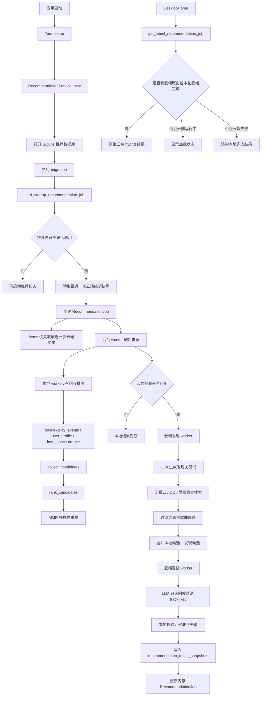
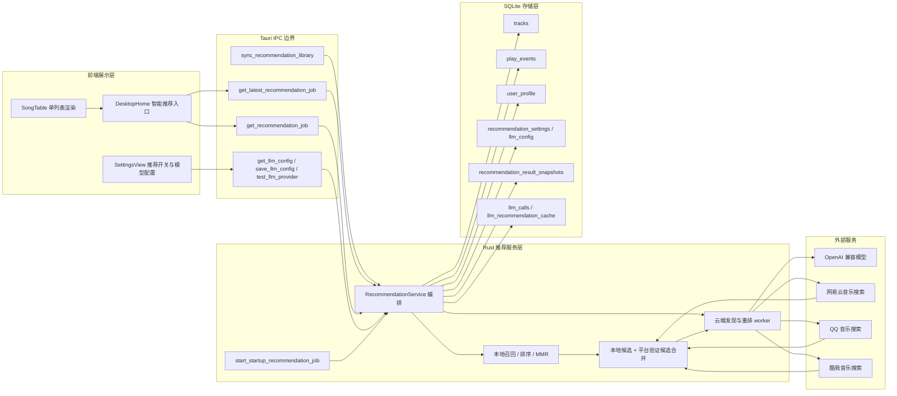
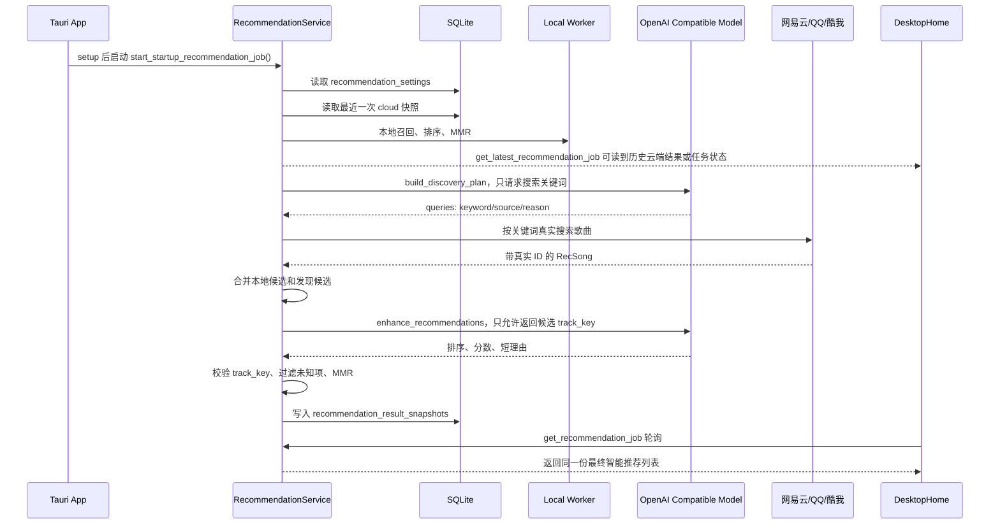

# TuneFree Desktop

TuneFree Desktop 是一款基于 Tauri v2、Next.js 16 和 React 19 构建的现代化高性能桌面音乐播放器。项目致力于在桌面端提供统一、流畅且极具质感的音乐流媒体聚合体验。

本分支（tauri 分支）代表 TuneFree 的原生桌面客户端实现，核心业务层由 Rust 构建的本地服务承载，包含 API 代理及音源解密模块，以解决跨域及网络限制问题。

## 技术架构

项目在架构设计上采用前后端分离的混编模式：

*   **容器层**：Tauri v2 运行时，提供原生系统 API 调用能力及轻量化 Webview 容器。
*   **前端渲染层**：Next.js 16 (静态导出) 与 React 19，负责核心 UI 组件渲染与播放状态管理。
*   **本地服务层**：Rust (基于 Axum 异步框架)，用于处理高并发的解密请求与本地音频接口代理。
*   **动效与交互**：Framer Motion 12，用于构建界面的物理阻尼过渡以及平滑转场动画。
*   **音效可视化**：基于 Web Audio API 获取音频时域/频域数据，结合 HTML5 Canvas 进行实时频谱绘制。

## 核心特性

*   **跨源音乐聚合**：集成网易云音乐、QQ音乐、酷我音乐等多家流媒体音源，实现全局跨平台搜索及无缝播放。
*   **智能推荐系统**：本地 SQLite 画像先召回候选，OpenAI 兼容云端模型生成发现方向并重排，后端通过网易云、QQ音乐、酷我音乐真实搜索验证新歌候选，最终只向前端输出一份推荐结果。
*   **原生拖拽标题栏**：采用无边框窗口设计，通过 Tauri 原生窗口控制 API，在前端构建支持鼠标物理拖动及高斯模糊视觉的自定义窗口控制条。
*   **大厂级交互动效**：使用 Framer Motion 实现迷你播放栏与全屏播放面板之间的三维阻尼收放过渡，同时在歌曲切换时应用 Slide Up 与 Cross-Fade 歌词渐显机制。
*   **智能桌面挂件**：内置可拖动的交互式“安和昴（486）”桌面宠物，实时监听播放器加载、播放、暂停等生命周期，其位置数据支持本地持久化存储。
*   **双语歌词系统**：支持 LRC 滚动歌词，能自动对齐双语翻译并提供点击精确定位播放进度的交互。

## 智能推荐系统架构

当前智能推荐不是前端点击后临时调用一个列表接口，也不是让大模型直接编写歌单。推荐系统运行在 Rust 后端，由 Tauri 启动阶段自动预热，前端只读取后端已有任务或最近一次云端成功结果。它的核心目标是：本地有兜底、云端能发现新歌、平台搜索验证真实存在、最终只展示一份推荐列表。

### 设计原则

*   **后端启动，不由前端触发核心任务**：`src-tauri/src/lib.rs` 在 Tauri `setup` 阶段创建 `RecommendationService`，随后调用 `start_startup_recommendation_job()`。前端进入首页时只调用 `get_latest_recommendation_job` 读取结果。
*   **云端结果优先，本地结果兜底**：如果数据库里存在最近一次云端 worker 成功结果，智能推荐页优先展示该结果；新一轮云端 worker 在后台刷新。只有云端不可用、失败或没有历史云端结果时，才使用本地候选兜底。
*   **大模型不直接返回最终歌曲**：发现阶段的大模型只能输出搜索关键词；最终重排阶段只能返回候选池内已存在的 `track_key`。任何候选池之外的歌曲都会被丢弃。
*   **新歌必须通过真实平台验证**：云端给出的关键词会进入网易云、QQ音乐、酷我音乐搜索。只有拿到真实平台歌曲 ID 的结果才会进入候选池。
*   **结果持久化**：云端 worker 成功完成后，结果写入 SQLite 的 `recommendation_result_snapshots`，下次启动可以直接显示上一次云端结果。
*   **单结果展示**：前端只有一个“智能推荐”入口，最终只渲染一份 `SongTable` 列表，不把本地推荐和云端推荐拆成两个列表。

### 总体架构图



### 分层架构图



### 后端模块清单

| 模块 | 路径 | 职责 |
| --- | --- | --- |
| Tauri 入口 | `src-tauri/src/lib.rs` | 注册 IPC、初始化 `RecommendationService`、应用启动时触发推荐预热 |
| 服务编排 | `src-tauri/src/recommendation/service.rs` | 串联本地召回、云端发现、平台验证、云端重排、结果快照和任务状态 |
| 数据库打开 | `src-tauri/src/recommendation/db.rs` | 使用 Tauri app data 目录创建 `tunefree/recommendation.sqlite` |
| 迁移 | `src-tauri/src/recommendation/migration.rs` | 创建推荐相关表、索引和默认配置 |
| 模型结构 | `src-tauri/src/recommendation/model.rs` | 定义 `RecSong`、`RecommendationItem`、`RecommendationJob`、LLM 配置视图 |
| 歌曲目录 | `src-tauri/src/recommendation/catalog.rs` | 生成 `track_key`、标准化歌曲、写入 `tracks` |
| 行为日志 | `src-tauri/src/recommendation/events.rs` | 定义播放、收藏、跳过、反馈等事件权重 |
| 用户画像 | `src-tauri/src/recommendation/profile.rs` | 从行为事件更新 `user_profile` token |
| 本地召回 | `src-tauri/src/recommendation/recall.rs` | 从画像、共现、收藏、歌单、队列等通道收集候选 |
| 本地排序 | `src-tauri/src/recommendation/rank.rs` | 计算本地相关性、来源偏好、近期惩罚、不感兴趣惩罚 |
| 多样性重排 | `src-tauri/src/recommendation/rerank.rs` | MMR 去重，限制单歌手、单来源过度集中 |
| 云端配置 | `src-tauri/src/recommendation/llm_config.rs` | 保存模型配置、API Key 状态、推荐总开关和测试连接配置 |
| OpenAI 兼容调用 | `src-tauri/src/recommendation/provider.rs` | 调用 `/chat/completions`，兼容 `base_url` 是否包含 `/v1` |
| Prompt | `src-tauri/src/recommendation/prompt.rs` | 构造发现关键词 prompt 和候选重排 prompt |
| LLM 解析 | `src-tauri/src/recommendation/llm.rs` | 解析发现计划、解析重排结果、校验候选 `track_key` |
| 平台发现 | `src-tauri/src/recommendation/discovery.rs` | 按关键词搜索网易云、QQ、酷我；酷我补封面；返回真实 `RecSong` |
| 隐私处理 | `src-tauri/src/recommendation/privacy.rs` | 截断理由、清理 base URL，避免日志和 UI 暴露敏感内容 |

### IPC 与前端入口

| IPC | 前端封装 | 用途 |
| --- | --- | --- |
| `log_recommendation_event` | `logRecommendationEvent` | 播放、跳过、收藏、反馈等行为进入推荐数据库 |
| `sync_recommendation_library` | `syncRecommendationLibrary` | 把收藏、歌单、队列、当前歌曲同步到 SQLite |
| `get_latest_recommendation_job` | `getLatestRecommendationJob` | 首页读取启动时预热任务或最近一次云端成功结果 |
| `get_recommendation_job` | `getRecommendationJob` | 轮询后台任务状态，云端完成后刷新同一份列表 |
| `start_recommendation_job` | `startRecommendationJob` | 保留手动启动能力，当前首页主链路不依赖它 |
| `get_home_recommendations` | `getHomeRecommendations` | 本地推荐兜底和兼容接口 |
| `get_similar_songs` | `getSimilarSongs` | 当前歌曲相似推荐 |
| `dismiss_recommendation` | `dismissRecommendation` | 标记不感兴趣，短期屏蔽类似结果 |
| `save_recommendation_feedback` | `saveRecommendationFeedback` | 保存点击、播放、dismiss 等推荐反馈 |
| `get_llm_config` | `getLlmConfig` | 设置页读取模型配置、推荐开关、缓存状态 |
| `save_llm_config` | `saveLlmConfig` | 设置页保存推荐开关、模型、API Key、超时和缓存配置 |
| `test_llm_provider` | `testLlmProvider` | 测试 OpenAI 兼容模型连接 |
| `clear_recommendation_data` | `clearRecommendationData` | 清空推荐画像、事件、缓存和反馈 |

### SQLite 表清单

| 表 | 内容 |
| --- | --- |
| `tracks` | 推荐系统知道的歌曲，包含来源、ID、歌名、歌手、专辑、封面和标准化字段 |
| `play_events` | 播放、完成、早切、收藏、歌单、下载、点击推荐等行为日志 |
| `user_profile` | 本地画像 token，例如歌手偏好、来源偏好、关键词偏好 |
| `item_cooccurrence` | 歌单和播放 session 内歌曲共现关系 |
| `recommendation_cache` | 本地推荐缓存预留表 |
| `recommendation_settings` | 推荐总开关，后端启动预热读取该表 |
| `recommendation_result_snapshots` | 云端 worker 成功完成后的最终结果快照；重启后默认读取这里 |
| `dismissed_recommendations` | 用户不感兴趣的歌曲，默认短期屏蔽 |
| `recommendation_feedback` | 推荐曝光后的播放、点击、dismiss 等反馈 |
| `llm_config` | OpenAI 兼容模型配置、API Key、超时、候选数、缓存时间 |
| `llm_recommendation_cache` | 云端重排响应缓存，减少重复请求 |
| `llm_calls` | 模型调用统计，不保存 API Key 和完整请求体 |

数据库位置由 Tauri 提供：

```text
{app_data_dir}/tunefree/recommendation.sqlite
```

Windows 上通常位于：

```text
C:\Users\{user}\AppData\Roaming\com.alanbulan.tunefree\tunefree\recommendation.sqlite
```

### 智能推荐完整链路



### 结果优先级

智能推荐页不会把“本地候选”当作默认智能推荐结果。实际优先级如下：

1. 读取 `recommendation_result_snapshots` 中最近一次云端成功结果，立即展示。
2. 新启动的云端 worker 在后台刷新，不阻塞用户进入页面。
3. 云端 worker 成功后，更新内存任务并写入新的快照。
4. 云端 worker 运行中且已有历史云端结果时，前端继续显示历史云端结果。
5. 云端 worker 运行中但没有历史云端结果时，前端显示加载状态，不强行展示本地候选。
6. 云端不可用、失败、超时且没有历史云端结果时，才显示本地兜底结果。

### 云端发现与新歌验证

云端不是只重排用户听过的歌曲。当前链路会让模型生成“搜索方向”，再由后端去真实平台找新歌。

发现阶段输入：

*   场景：`home` 或 `similar`
*   用户画像 Top token
*   本地候选摘要
*   当前 seed 歌曲，可为空

发现阶段输出：

```json
{
  "queries": [
    {
      "keyword": "城市夜行电子",
      "source": "all",
      "reason": "扩展夜间电子氛围"
    }
  ]
}
```

平台验证阶段：

*   `netease`：调用网易云搜索接口，解析真实歌曲 ID、歌名、歌手、专辑、封面。
*   `qq`：调用 QQ Musicu 搜索接口，解析 `mid`、歌手、专辑 mid，并构造封面。
*   `kuwo`：调用酷我旧版搜索接口，解析 `MUSICRID`，再调用 `artistpicserver` 补封面。

只有这些平台搜索返回的真实 `RecSong` 会进入候选池。模型不能直接把自己“想出来”的歌放进最终列表。

### 云端最终重排

最终重排输入是“本地候选 + 平台验证过的新歌候选”。Prompt 明确要求：

*   只能返回 `candidates` 中存在的 `track_key`。
*   不能编造歌曲、歌手、专辑。
*   推荐理由必须是短中文句子。
*   输出必须是 JSON。

后端校验规则：

*   `track_key` 不在候选池内则丢弃。
*   未知 key 超过 20% 时整次响应作废。
*   缺少 `score` 时按 `rank` 转换。
*   未被模型返回的候选会按本地分数排到后面。
*   最后仍会经过 MMR，避免同歌手、同来源、同专辑过度集中。

候选进入重排窗口时还有一层保护：`llm_config.max_candidates` 可能被用户设置得很小，如果合并时先放满本地候选，平台验证过的新歌候选会排在窗口之外，模型最终重排时就看不到新歌。当前实现会读取 `max_candidates`，在合并候选时优先保留一段本地锚点，再把平台验证候选提升到 LLM 可见窗口内。以 `max_candidates = 12` 为例，如果有足够的新歌发现候选，前 12 个候选中会保留本地候选和发现候选的混合结果，而不是 12 个全部来自本地。

这层保护只影响云端重排的候选输入顺序，不改变前端展示模型：前端仍然只看到一个 `hybrid` 智能推荐结果列表。

### 端到端验证口径

“能找到新歌”在当前推荐系统里不是指模型自己编一份新歌单，而是满足下面四个条件：

1. OpenAI 兼容模型连接成功，并能按后端要求返回合法 JSON。
2. 发现阶段返回的是搜索关键词，不是最终歌曲。
3. 后端用这些关键词调用网易云、QQ 音乐、酷我音乐真实搜索，并拿到真实平台 ID。
4. 搜索结果和本地 `tracks` 表按“歌名 + 歌手”去重后，存在本地推荐库没有的候选。

本次本地真实配置验证结果：

| 项目 | 结果 |
| --- | --- |
| 模型连通性 | 成功 |
| JSON Object 响应 | 支持 |
| 画像 token | 30 个 |
| 本地 tracks 对比基数 | 368 首 |
| 模型发现关键词 | 6 条 |
| 平台搜索去重候选 | 34 首 |
| 本地库未出现候选 | 29 首 |

完整重排模拟验证结果：

| 项目 | 结果 |
| --- | --- |
| 当前 `max_candidates` | 12 |
| 进入 LLM 的候选窗口 | 12 首 |
| 窗口内平台验证发现候选 | 6 首 |
| 模型最终返回候选 | 12 首 |
| 模型返回未知 `track_key` | 0 个 |
| 最终返回发现候选 | 6 首 |
| 最终返回本地库未出现发现候选 | 6 首 |

本次搜索验证到的未入库候选示例：

| 来源 | 歌曲 | 歌手 | 触发关键词 |
| --- | --- | --- | --- |
| 网易云 | 美人鱼 | 林俊杰 | 林俊杰 系男声 情绪抒情 国语新歌 |
| 网易云 | 恨幸福来过 | 林俊杰 | 林俊杰 系男声 情绪抒情 国语新歌 |
| 网易云 | 让我留在你身边 | 陈奕迅 | 陈奕迅 五月天 情绪摇滚 情歌 |
| 网易云 | 雑踏、僕らの街 | トゲナシトゲアリ | トゲナシトゲアリ 日文 另类电子 独立 |
| 网易云 | NEO | 初音ミク, 星乃一歌, 花里みのり, 小豆沢こはね, 天馬司, 宵崎奏, じん | 初音ミク 星乃一歌 花里みのり 协作 |
| 酷我 | 本色 | 泠鸢yousa | 泠鸢yousa 日系电子翻唱 声优向 |

### 失败与降级

| 场景 | 行为 |
| --- | --- |
| 推荐总开关关闭 | 后端不启动预热任务，前端无智能推荐结果 |
| 云端配置缺失 | 返回本地推荐作为兜底 |
| API Key 错误 | 设置页记录错误，推荐页保留历史云端结果或本地兜底 |
| 发现关键词生成失败 | 保留历史云端结果或本地候选 |
| 平台搜索无结果 | 不保存新快照，保留最近一次云端结果 |
| 云端重排 JSON 无效 | 不保存新快照，保留最近一次云端结果 |
| 应用重启 | 从 `recommendation_result_snapshots` 读取最近一次云端成功结果 |

### 隐私与安全边界

*   API Key 只保存在本地 SQLite 的配置表中，不写入日志、不提交仓库、不返回给普通前端状态。
*   云端请求只上传候选歌曲元数据、画像摘要和场景，不上传音频文件、下载路径、完整播放历史或歌词全文。
*   `llm_calls` 只记录模型名、状态、延迟、候选数量、结果数量和错误摘要。
*   清空推荐数据只删除推荐事件、画像、缓存和反馈，不删除收藏、歌单和下载文件。

## 目录结构

```text
├── app/                  # Next.js App Router 路由与页面配置
│   ├── desktop-lyric/    # 桌面歌词窗口路由
│   ├── library/          # 音乐库页面
│   └── search/           # 搜索页面
├── src/
│   ├── core/             # 音乐服务、上下文管理器与核心类型定义
│   └── desktop/          # 桌面端专用交互组件与主视图
├── src-tauri/
│   ├── src/              # Rust 后端主程序与 Axum 代理服务
│   ├── icons/            # 应用程序多尺寸图标资产
│   ├── Cargo.toml        # Rust 依赖与 crate 配置
│   └── tauri.conf.json   # Tauri 容器配置文件
├── public/               # 静态前端资源
├── bump-version.js       # 统一版本号自增脚本（tauri.conf.json / package.json / Cargo.toml）
├── vitest.config.ts      # Vitest 测试配置
└── package.json          # 前端依赖与构建脚本
```

## 开发与构建指南

### 前置依赖

运行本项目前，请确保您的开发环境已安装以下工具：

*   Node.js (建议 v20.9 或以上)
*   Rust 工具链 (包括 cargo 及 rustc compiler)
*   C++ 构建环境 (Windows 平台下需安装 Visual Studio 生成工具)

### 本地开发

1.  克隆仓库并安装 Node 依赖包：
    ```bash
    npm install
    ```

2.  启动开发模式：
    ```bash
    npm run tauri dev
    ```
    该命令会自动运行 Next.js 前端开发服务（端口 3001）并拉起 Tauri 容器，同时在 Rust 后端初始化本地 Axum 代理服务（端口 3002）。

### 生产打包

如需将应用程序打包为独立安装文件，请运行：

```bash
npm run tauri build
```

构建完成后，程序将输出在以下路径：
*   **NSIS 安装程序 (Windows EXE)**: `src-tauri/target/release/bundle/nsis/TuneFree_{version}_x64-setup.exe`

> 其中 `{version}` 为 `tauri.conf.json` 中配置的当前版本号（如 `1.0.25`）。

## 声明

*   本项目仅作为 Next.js、Tauri 与 Rust 混编的交互技术研究使用。
*   音乐资源均来源于第三方 API，本项目不存储、不分发任何音频实体，请支持正版音乐。
